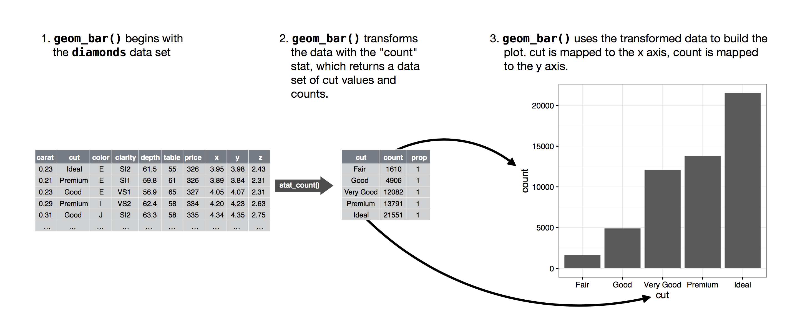

# Git y GitHub

Clonamos el repo antiguo del club_de_R que ya existía. Rena tiene windows entonces instaló Git Bash (https://gitforwindows.org/) y VSCode (https://code.visualstudio.com/). Fran tiene Mac entonces viene por defecto Git, y ya tenía previamente instalado VSCode.

Esto lo hicimos para poder ir guardando nuestras actualizaciones y versiones en GitHub, a medida que vayamos avanzando en las sesiones de estudio. Nuestro primer objetivo es leer el libro "R for Data Science" de (Wickham, Garret Centigaka-Rundel).

# Libro R for Data Science

## Whole game

En este libro se escribe en Tidyverse principalmente, no en Rbase. Tidyverse tiene nueve parquetes: dplyr, purrr, forcats, lubridate, tidyr, readr, stringr, tibble, ggplot2. Para ver actualizaciones de tidyverse:

```{r}
#install.packages("tidyverse") 
library(tidyverse) # para cargar la librería, que incluye los otros 9 paquetes
# tidyverse_update() # para actualizaciones
```

### 1 Data visualition

Hay paquetes que vienen con datos disponibles para practicar. Con el paquete ggplot2 se usar para hacer gráficos y también para estéticas.

Si no tienes un paquete instalado, debes hacerlo para poder cargarlo con library().

```{r}
library(palmerpenguins)
library(ggthemes)

palmerpenguins::penguins
```

Para tener una idea de los datos, podemos usar la función gimplse. Nos dice la cantidad filas y columnas que tiene la base de datos, y el tipo de datos de cada columna.También muestra los datos de las primeras filas de cada columna, separados por comas.

```{r}
glimpse(penguins)
```

Para graficar se usa ggplot2 y se escribe por capas:

```{r}
ggplot(
  data = penguins, # se especifica de donde sacamos los datos para graficar
  mapping = aes(x = flipper_length_mm, y = body_mass_g) # variables de los ejes
) +
  geom_point(aes(color = species, shape = species)) + # tipo de graficos y si es que se quiere color y forma, en base a alguna variable, en este caso la especie
  geom_smooth(method = "lm") + # agrega línea de tendencia
  labs( # para agregar nombres y etiques al gráficos
    title = "Body mass and flipper length",
    subtitle = "Dimensions for Adelie, Chinstrap, and Gentoo Penguins",
    x = "Flipper length (mm)", y = "Body mass (g)",
    color = "Species", shape = "Species"
  ) +
  scale_color_colorblind() # otra escala de colores
```

Si quieren datos para practicar está la iniciativa TidyTuesday: https://github.com/rfordatascience/tidytuesday

También se pueden hacer facetas con facet_wrap():

```{r}
ggplot(penguins, aes(x = flipper_length_mm, y = body_mass_g)) +
  geom_point(aes(color = species, shape = species)) +
  facet_wrap(~island)
```

Y para guardar los gráficos está gg_save():

```{r}
ggplot(penguins, aes(x = flipper_length_mm, y = body_mass_g)) +
  geom_point()
ggsave(filename = "penguin-plot.png") #esto quedará guardado en el directorio del proyecto
```

### 2 Workflow: basics

Las variables solo prueden ser letras y pueden estar separadas por "\_" o ".", y puede contener números pero no empezar con ellos.

```{r}
# 1hola <- "hola"
hola <- "hola"
```

### 3 Data transformation

Usan otra libería para tener datos

```{r}
library(nycflights13)
flights #base de datos a usar
```

#### filter()

Para hacer un pipe en mac: shift + command + m Para hacer un pipe en windows: shift + control + m

```{r}
flights %>%  
  filter(dep_delay > 120) #filtramos todas las mayores a 120 en dep_delay

flights %>%  
  filter(month == 1 & day == 1) #filtrarmos los meses mayor a 1 y día mayor a 1

flights %>% 
  filter(month == 1 | month == 2) # "o"

flights %>%  
  filter(month %in% c(1, 2)) # %n% significa que contiene 1 o 2, es lo mismo que el anterior

flights %>%  
  filter(month == 1)
```

#### arrange()

Cambia el orden de las filas segun el valor de las columnas

```{r}
flights %>%  
  arrange(year, month, day, dep_time) # ordena de menor a mayor

flights %>%  
  arrange(desc(dep_delay)) # desc() ordena de mayor a menor
```

#### distinct()

Encuentra todos las filas únicas en un conjunto de datos

```{r}
flights %>%  
  distinct(origin, dest) 

flights %>% 
  distinct(origin, dest, .keep_all = TRUE) #nos mantiene la info de las otras columnas
```

#### mutate()

Para crear columnas nuevas

```{r}
flights %>%  # creamos la columna gain y speed, a partir de otras columnas del tibble
  mutate(
    gain = dep_delay - arr_delay,
    speed = distance / air_time * 60
  )

flights %>% 
  mutate(
    gain = dep_delay - arr_delay,
    hours = air_time / 60,
    gain_per_hour = gain / hours,
    .keep = "used" # me deja solo las columnas usadas y las nuevas
  )
```

#### select()

Para seleccionar o eliminar columnas

```{r}
flights %>% 
  select(year, month, day) 

flights %>%  
  select(year:day) # selecciona todas las columnas entre year y day, ambas incluso

flights %>% 
  select(!year:day) # para no seleccionar esas

flights %>%  
  select(where(is.character))

flights %>% 
  select(tail_num = tailnum) # se pueden renombrar las variables seleccionadas
```

#### rename()

Para renombrar nombres de variables

```{r}
flights %>% 
  rename(tail_num = tailnum)
```

#### relocate()

Para mover las variables

```{r}
flights %>%  
  relocate(time_hour, air_time)

flights %>% relocate(year:dep_time, .after = time_hour) # para especificar donde ponerlas (.after y .before)
flights %>% relocate(starts_with("arr"), .before = dep_time)
```

#### group_by()

Agrupa las filas

```{r}
flights %>%  
  group_by(month) # en este caso la estructura de la tabla es la misma, pero está agrupada por grupos, entonces al hacer análisis después es a partir de estos grupos
```

#### summarize()

```{r}
flights %>% 
  group_by(month) %>%  
  summarize(
    avg_delay = mean(dep_delay)) # como tiene NAs, el promedio es NA, pero se puede corregir con lo siguiente
  
flights %>% 
  group_by(month) %>%  
  summarize(avg_delay = mean(dep_delay, na.rm = TRUE))

flights %>%  
  group_by(month) %>%  
  summarize(
    avg_delay = mean(dep_delay, na.rm = TRUE), 
    n = n()) #numero de datos
```

#### slice\_ functions

-   df %\>% slice_head(n = 1) takes the first row from each group.
-   df %\>% slice_tail(n = 1) takes the last row in each group.
-   df %\>% slice_min(x, n = 1) takes the row with the smallest value of column x.
-   df %\>% slice_max(x, n = 1) takes the row with the largest value of column x.
-   df %\>% slice_sample(n = 1) takes one random row.

```{r}
flights %>% 
  group_by(dest) %>% 
  slice_max(arr_delay, n = 1) %>%
  relocate(dest)
```

#### ungroup()

Para desagrupar

```{r}
flights %>%  
  ungroup()
```

#### .by()

Para agrupar dentro del código, sin usar group_by()

```{r}
flights %>% 
  summarize(
    delay = mean(dep_delay, na.rm = TRUE), 
    n = n(),
    .by = month
  )

flights %>% 
  summarize(
    delay = mean(dep_delay, na.rm = TRUE), 
    n = n(),
    .by = c(origin, dest) # para múltiples variables
  )
```

###4 Workflow

El estilo de código utilizado en este libro es de Tidyverse: https://style.tidyverse.org/

Existe el paquete 'styler, el cual permite cambiar el estilo de código rápidamente.

```{r}
#install.packages("styler")
library(styler)
```

###5 Ordenando datos

Nos centraremos en el paquete 'tidyr'(incluido en tidyverse).

```{r}
library(tidyverse)
```

####Tidy data

Trabajaremos utilizando el sistema tidy data para ordenar los datos.

Hay tres reglas interrelacionadas que hacen que un conjunto de datos esté ordenado:

1.  Cada variable es una columna; cada columna es una variable.
2.  Cada observación es una fila; cada fila es una observación.
3.  Cada valor es una celda; cada celda es un valor único.

####Alargar datos

tidyr proporciona dos funciones para pivotar datos: pivot_longer() y pivot_wider()

```{r}
billboard <- billboard

billboard_largo <- billboard %>% 
  pivot_longer(
    cols = starts_with("wk"), 
    names_to = "week", 
    values_to = "rank",
    values_drop_na = TRUE
  ) %>% 
  mutate(
    week = parse_number(week) #extrae el primer número de la cadena, ignorando el resto del texto. Esta función es de readr.
  )
```

####Muchas variables en los nombres de las columnas

```{r}
who2 <- who2 #Aquí las variables están separadas por un guión bajo: primero está el método de diagnóstico, luego el género y finalmente el rango de edad.

who2_pivoteado <- who2 %>% 
  pivot_longer(
    cols = !(country:year),
    names_to = c("diagnosis", "gender", "age"), 
    names_sep = "_",
    values_to = "count"
  )

#Ahora cada columna es una variable diferente, sp es el método utilizado para el diagnóstico, gender es el género y age el rango de edad. 

```

####Ampliación de datos

Utilizaremos la función pivot_wider()

```{r}

billboard_ancho <- billboard_largo %>% 
  pivot_wider(names_from = "week",
              values_from = "rank",
              names_prefix = "wk")

```

###6 Flujo de trabajo: scripts y proyectos

Hay que distinguir entre "directorio de trabajo", "proyecto de RStudio" y "scripts".

1.  Directorio de trabajo: R buscará aquí los archivos que le pides que cargue, y colocará los archivos que le pides que guarde. RStudio muestra su directorio de trabajo actual en la parte superior de la consola.

2.  Proyecto de RStudio: Se almacena en un directorio de trabajo determinado, junto a otros archivos, como datos, scripts y gráficos, etc.

3.  Script: Aquí se escribe el código, se generan los gráficos y resultados analíticos, etc.

###7 Importación de datos

Utilizaremos el paquete readr de Tidyverse. Existen distintas funciones para importar datos:

```{r}
# read_csv() Para leer datos en formato csv.

# read_csv2() lee archivos separados por punto y coma. Estos usan ; en lugar de , para separar campos y son comunes en países que usan , como marcador decimal.

# read_tsv() lee archivos delimitados por tabuladores.

# read_delim() lee archivos con cualquier delimitador, intentando adivinar automáticamente el delimitador si no lo especificas.

# read_fwf() lee archivos de ancho fijo. Puede especificar campos por sus anchos con fwf_widths() o por sus posiciones con fwf_positions().

# read_table() lee una variación común de archivos de ancho fijo donde las columnas están separadas por espacios en blanco.

# read_log() lee archivos de registro de estilo Apache.

```

Se utiliza la función clean_names() del paquete janitor para transformar los datos de una manera en que sean fáciles de analizar.

```{r}
#install.packages("janitor")
#janitor::clean_names()
```

####Escribir un archivo Se utiliza la función write_csv() para guardar una tabla en formato csv.

```{r}
billboard
write_csv(billboard, "billboard.csv")
```

###Obtener ayuda

Para mantenerse al día con la comunidad de tidyverse (https://www.tidyverse.org/blog/) y R (https://rweekly.org/)

## Visualize

### 9 Layers (fran)

Recursos útiles: https://ggplot2-book.org/
Extensiones ggplot: https://exts.ggplot2.tidyverse.org/gallery/

```{r}
library(tidyverse)

mpg # modelos automóviles
```

color, shape, size, alpha

```{r}
ggplot(mpg, aes(x = displ, y = hwy, color = class)) +
  geom_point()

ggplot(mpg, aes(x = displ, y = hwy, shape = class)) +
  geom_point()
```

Asignar una variable discreta (categórica) no ordenada (class) a una estética ordenada ( sizeo alpha) generalmente no es una buena idea porque implica una clasificación que en realidad no existe.


Más info estética: https://ggplot2.tidyverse.org/articles/ggplot2-specs.html

#### Geometric objects

Formas de linea

```{r}
ggplot(mpg, aes(x = displ, y = hwy, color = drv)) + 
  geom_point() +
  geom_smooth(aes(linetype = drv))
```

geom_smooth() puedes establecer la groupestética en una variable categórica para dibujar varios objetos.

```{r}
ggplot(mpg, aes(x = displ, y = hwy)) +
  geom_smooth(aes(color = drv), show.legend = FALSE)
```

Puede ser color solo una geometría por ejemplo:

```{r}
ggplot(mpg, aes(x = displ, y = hwy)) + 
  geom_point(aes(color = class)) + 
  geom_smooth()
```

Se pueden hacer filtros y graficar diferente con una misma geometría:

```{r}
ggplot(mpg, aes(x = displ, y = hwy)) + 
  geom_point() + 
  geom_point(
    data = mpg |> filter(class == "2seater"), 
    color = "red"  # para círculo rojo
  ) +
  geom_point(
    data = mpg |> filter(class == "2seater"), 
    shape = "circle open", size = 3, color = "red" # para el borde rojo
  )
```

Otros tipos de geom_():

```{r}
ggplot(mpg, aes(x = hwy)) +
  geom_histogram(binwidth = 2)

ggplot(mpg, aes(x = hwy)) +
  geom_density()

ggplot(mpg, aes(x = hwy)) +
  geom_boxplot()
```

ggplot2 proporciona más de 40 geoms, pero estos no cubren todos los gráficos posibles que se pueden crear. Si necesita un geom diferente, le recomendamos que primero consulte los paquetes de extensión para ver si alguien más ya lo ha implementado (consulte https://exts.ggplot2.tidyverse.org/gallery/ para ver una muestra).

Por ejemplo, el paquete ggridges ( https://wilkelab.org/ggridges ) es útil para crear gráficos de crestas, que pueden ser útiles para visualizar la densidad de una variable numérica para diferentes niveles de una variable categórica.

```{r}
library(ggridges)

ggplot(mpg, aes(x = hwy, y = drv, fill = drv, color = drv)) +
  geom_density_ridges(alpha = 0.5, show.legend = FALSE)
```

El mejor lugar para obtener una descripción general completa de todos los geoms que ofrece ggplot2, así como de todas las funciones del paquete, es la página de referencia: https://ggplot2.tidyverse.org/reference . Para obtener más información sobre cualquier geom en particular, utilice la ayuda (por ejemplo, ?geom_smooth)

#### Facets

```{r}
# una faceta:

ggplot(mpg, aes(x = displ, y = hwy)) + 
  geom_point() + 
  facet_wrap(~cyl)

# 2 variables:

ggplot(mpg, aes(x = displ, y = hwy)) + 
  geom_point() + 
  facet_grid(drv ~ cyl)
```

By default each of the facets share the same scale and range for x and y axes.

```{r}
ggplot(mpg, aes(x = displ, y = hwy)) + 
  geom_point() + 
  facet_grid(drv ~ cyl, scales = "free")
```

Un clásico gráfico de barras, geom_bar() or geom_col(). The following chart displays the total number of diamonds in the diamonds dataset, grouped by cut.

```{r}
ggplot(diamonds, aes(x = cut)) + 
  geom_bar()
```

En el caso anterior no se especifica nada en el eje Y y algunos geom_() calculan automáticamente cosas.

 Puedes saber qué estadística usa un geom inspeccionando el valor predeterminado del statargumento. Puede cambiar

```{r}
?geom_bar # dice "stat = "count", significa que geom_bar() usa stat_count()

diamonds |>
  count(cut) |>
  ggplot(aes(x = cut, y = n)) +
  geom_bar(stat = "identity")

# grafico de proporciones:
ggplot(diamonds, aes(x = cut, y = after_stat(prop), group = 1)) + 
  geom_bar()
```

Es posible que desee resaltar la transformación estadística en su código. Por ejemplo, podría usar stat_summary(), que resume los valores de y para cada valor único de x, para destacar el resumen que está calculando:

```{r}
ggplot(diamonds) + 
  stat_summary(
    aes(x = cut, y = depth),
    fun.min = min,
    fun.max = max,
    fun = median
  )
```

#### Position adjustments

Colores barras:

```{r}
ggplot(mpg, aes(x = drv, color = drv)) + 
  geom_bar()

ggplot(mpg, aes(x = drv, fill = drv)) + 
  geom_bar()
```

Y si agregamos una tercera variable:

```{r}
ggplot(mpg, aes(x = drv, fill = class)) + 
  geom_bar()
```

Position = "identify", colocará cada objeto exactamente donde cae en el contexto del gráfico. Esto no es muy útil para las barras, porque las superpone. Para ver esa superposición, necesitamos hacer que las barras sean ligeramente transparentes.

```{r}
ggplot(mpg, aes(x = drv, fill = class)) + 
  geom_bar(alpha = 1/5, position = "identity")

ggplot(mpg, aes(x = drv, color = class)) + 
  geom_bar(fill = NA, position = "identity")
```

-   position = "fill". Funciona como apilar, pero hace que cada conjunto de barras apiladas tenga la misma altura. Esto facilita la comparación de proporciones entre grupos.

-   position = "dodge". Coloca los objetos superpuestos directamente uno al lado del otro. Esto facilita la comparación de valores individuales.

```{r}
ggplot(mpg, aes(x = drv, fill = class)) + 
  geom_bar(position = "fill")

ggplot(mpg, aes(x = drv, fill = class)) + 
  geom_bar(position = "dodge")
```

Para puntos, superposición de puntos: Puedes evitar este efecto de cuadrícula configurando el ajuste de posición en "jitter". position = "jitter"Esto añade una pequeña cantidad de ruido aleatorio a cada punto. De esta forma, los puntos se dispersan, ya que es poco probable que dos puntos reciban la misma cantidad de ruido aleatorio.

```{r}
ggplot(mpg, aes(x = displ, y = hwy)) + 
  geom_point(position = "jitter")
```

Debido a que esta es una operación tan útil, ggplot2 viene con una abreviatura para geom_point(position = "jitter"): geom_jitter().

Para obtener más información sobre un ajuste de posición, consulte la página de ayuda asociada con cada ajuste: ?position_dodge, ?position_fill, ?position_identity, ?position_jitter, y ?position_stack.

#### Sistema de coordenadas

El sistema de coordenadas predeterminado es el cartesiano, donde las coordenadas x e y actúan de forma independiente para determinar la ubicación de cada punto. Existen otros dos sistemas de coordenadas que resultan útiles en ocasiones.

-   'coord_quickmap()' -> Establece correctamente la relación de aspecto para mapas geográficos. Esto es muy importante si se representan datos espaciales con ggplot2. Más info: https://ggplot2-book.org/maps.html

```{r}
nz <- map_data("nz")

ggplot(nz, aes(x = long, y = lat, group = group)) +
  geom_polygon(fill = "white", color = "black")

ggplot(nz, aes(x = long, y = lat, group = group)) +
  geom_polygon(fill = "white", color = "black") +
  coord_quickmap()
```

-   'coord_polar()' -> Utiliza coordenadas polares. Las coordenadas polares revelan una interesante conexión entre un gráfico de barras y un gráfico de Coxcomb.

```{r}
bar <- ggplot(data = diamonds) + 
  geom_bar(
    mapping = aes(x = clarity, fill = clarity), 
    show.legend = FALSE,
    width = 1
  ) + 
  theme(aspect.ratio = 1)

bar + coord_flip()
bar + coord_polar()
```

### 10 Exploratory data analysis (rena)